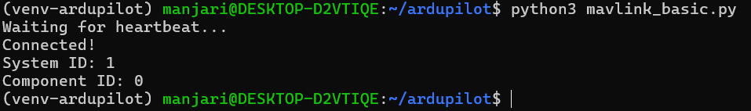
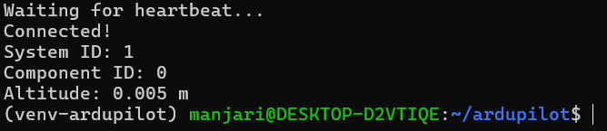
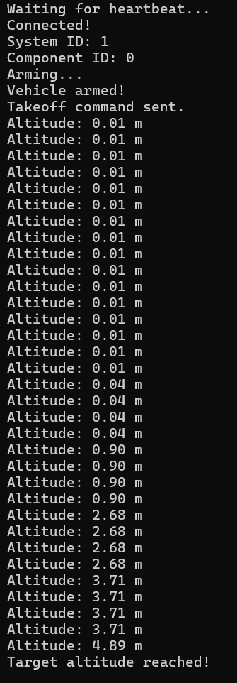
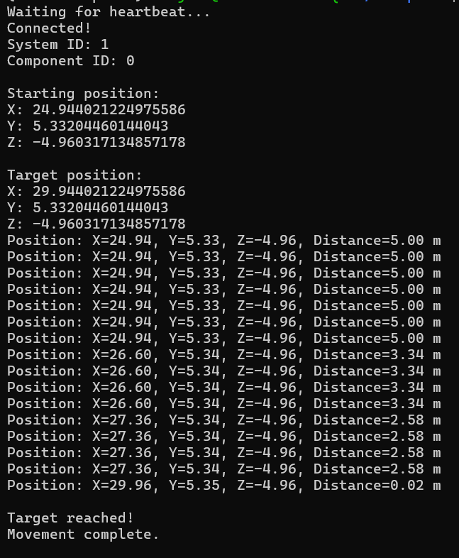
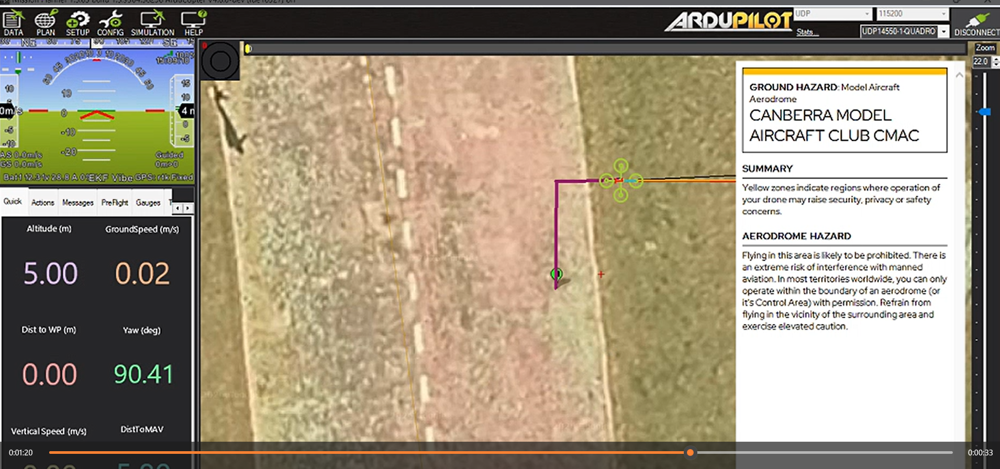

# ArduPilot SITL UAV Simulation & MAVLink Control

A hands-on project to understand how **MAVLink, ArduPilot, flight control, telemetry, and autonomous UAV movement** work together.

This project is being developed step by step using **ArduPilot SITL (Software-In-The-Loop)** instead of a physical drone. The main goal is not just to make a simulated drone move, but to understand what is happening behind the commands and how the same concepts are used in a real UAV.

---

## 🎯 About This Project

I started this project to build a practical understanding of **UAV communication and control** before working with real drone hardware.

Through the project, I am learning:

* How a computer communicates with a UAV
* What MAVLink is and how it is used
* How Python can communicate with ArduPilot
* How telemetry is received from a UAV
* How flight modes and commands work
* How position commands are sent to a drone
* How ArduPilot handles low-level flight control
* How autonomous movement can be created
* How coordinate systems are used in UAV navigation
* How a simulated UAV system relates to a real drone

The project is intentionally divided into stages so that I can understand each concept before moving to the next one.

---

## 🧩 Project Architecture

The current simulation can be understood as:

```text
                 My Python Program
                       │
                       │ pymavlink
                       ▼
                    MAVLink
                       │
                       ▼
                ArduPilot SITL
                       │
                       ▼
                Simulated UAV
                       │
                       ▼
              Mission Planner
```

Python is used to send commands and receive telemetry.

**MAVLink** provides the communication protocol.

**ArduPilot** receives the commands and performs the flight-control calculations.

**SITL** provides a simulated UAV environment, allowing the system to be tested without physical hardware.

**Mission Planner** is used to observe and interact with the simulated vehicle.

---

# 🚁 What is MAVLink?

One of the first things I wanted to understand was **how software communicates with a UAV**.

MAVLink is a lightweight communication protocol commonly used in unmanned vehicle systems.

It allows different components of a UAV system to exchange information.

For example:

```text
Python → MAVLink → ArduPilot
```

can be used to send commands such as:

* Change flight mode
* Arm the vehicle
* Take off
* Move to a position
* Land

Communication also happens in the opposite direction:

```text
ArduPilot → MAVLink → Python
```

which can provide information such as:

* Position
* Altitude
* Flight state
* Battery information
* Attitude
* Other vehicle telemetry

Through this project, I am learning to think of MAVLink as the **communication layer between the software controlling the mission and the flight controller**.

---

# 💻 Development Environment

The project is currently developed completely in simulation.

### Software

* Python
* `pymavlink`
* MAVLink
* ArduPilot
* ArduCopter
* ArduPilot SITL
* MAVProxy
* Mission Planner
* WSL2
* Ubuntu

### Development Environment

```text
Windows
   │
   └── WSL2
        │
        └── Ubuntu
             │
             ├── Python
             ├── pymavlink
             └── ArduPilot SITL
```

---

# 📚 Project Stages

The project is divided into four main stages.

Each stage focuses on a different part of understanding UAV communication and control.

---

## Stage 1 — MAVLink Basics

### Goal

The first step was simply to understand how Python can communicate with ArduPilot.

I created a basic Python program that connects to ArduPilot SITL through MAVLink and waits for a heartbeat.

The program can identify the connected system and component.

### What I learned

* What a MAVLink connection is
* What a heartbeat message is
* How a Python program establishes communication with ArduPilot
* System ID and component ID
* The basic structure of `pymavlink`
* How a ground/computer system communicates with a flight controller

### Demonstration



---

## Stage 2 — Telemetry

### Goal

After establishing communication, the next step was to understand how information can be received from the simulated UAV.

I used MAVLink telemetry messages to obtain information such as the UAV's relative altitude and local position.

For example, the UAV's relative altitude can be obtained from:

```text
GLOBAL_POSITION_INT
```

### What I learned

* What telemetry means
* How UAV state information is transmitted
* How to receive specific MAVLink messages
* Relative altitude
* Local position
* The difference between sending commands and receiving telemetry
* How feedback can be used by a control program

### Demonstration



---

## Stage 3 — Flight Control

### Goal

The next step was to move from simply reading information to actually controlling the simulated UAV.

I learned how to:

* Arm the simulated vehicle
* Change flight modes
* Take off
* Send position targets
* Monitor the UAV while it is moving

I also learned that the Python program does **not directly control the four motors**.

Instead, Python sends a high-level command through MAVLink, and ArduPilot handles the lower-level flight-control process.

### What I learned

* ArduPilot flight modes
* Guided flight
* Arming and takeoff
* Position control
* MAVLink command messages
* Sending continuous position targets
* Monitoring movement using telemetry
* The relationship between a desired position and the actual UAV position



---

## Stage 4 — Autonomous Navigation

### Goal

The final stage is focused on combining the previous concepts to create simple autonomous flight behaviour.

The first planned trajectory is an L-shaped path:

```text
Start
  ●
  │
  │  Move forward
  │
  ▼
  ●──────────►
       Move right
```

### What I am learned

* Autonomous movement
* UAV coordinate systems
* `LOCAL_NED`
* Position targets

### Demonstration
 
[▶ Watch the full Stage 4 demonstration(Google Drive Link] https://drive.google.com/drive/folders/1-9VOnyF1I6tfyFyLfSeA3WrLtvKgwdIq?usp=sharing
[▶ Watch the full Stage 4 demonstration](assets/stage4demo.mp4)
---

# 🧭 Understanding the Coordinate System

An important concept I learned is the **MAVLink Local NED coordinate system**.

NED stands for:

**North - East - Down**

```text
             +X
             North
               ↑
               │
               │
               ●────────────→ +Y
                         East

               ↓
              +Z
             Down
```

In the local NED frame:

* `X` represents North
* `Y` represents East
* `Z` represents Down

Therefore, when the UAV is above the local origin, its Z position is normally negative.

For example:

```text
X = 5 m
Y = 2 m
Z = -5 m
```

means the UAV is approximately:

* 5 m North
* 2 m East
* 5 m above the local origin

Understanding coordinate frames is important because autonomous navigation depends heavily on knowing **where the UAV is and where it should go**.

---

# 🔄 How I Understand the Simulation

At first, I thought of the Python program as something that directly controls the drone.

After working with SITL and MAVLink, I understood that the system is divided into different responsibilities.

The simplified process is:

```text
          Python
             │
             │
        "Go to this position"
             │
             ▼
          MAVLink
             │
             ▼
         ArduPilot
             │
             │ Calculates how
             │ to achieve the target
             ▼
       Simulated UAV
             │
             │
        Position changes
             │
             ▼
          Telemetry
             │
             ▼
           Python
```

So my Python program mainly works at the **higher level**.

It tells ArduPilot what I want the UAV to do and receives information about what the UAV is actually doing.

ArduPilot is responsible for the lower-level flight-control process.

This separation is one of the main concepts I wanted to understand through this project.

---

# 🌍 How This Relates to a Real Drone

The simulation is not simply a completely different system from a real UAV.

The important communication concept is very similar.

### In this project

```text
Python
   │
 MAVLink
   │
   ▼
ArduPilot SITL
   │
   ▼
Simulated UAV
```

### In a real UAV

```text
Companion Computer
(like Raspberry Pi)
          │
        MAVLink
          │
          ▼
   Flight Controller
          │
      ArduPilot
          │
          ▼
     ESCs + Motors
          │
          ▼
      Real UAV
```

A real drone would also have physical sensors such as:

* GPS
* Barometer
* Compass
* Other sensors 

The flight controller uses this information to estimate the vehicle's state and control the aircraft.

Therefore, the main difference is that **SITL replaces the physical hardware with a software simulation**.

This allows me to learn the software and communication side of UAVs without needing a physical drone.

---

# 🧠 What I Am Learning From the Project

This project is helping me connect several topics that are often learned separately.

### 1. UAV Communication

Understanding how different components exchange information using MAVLink.

### 2. Flight Controller Architecture

Understanding the role of ArduPilot and why a companion computer does not necessarily control the motors directly.

### 3. Telemetry

Learning how a UAV reports its current state back to another computer.

### 4. Coordinate Systems

Understanding how position and movement are represented mathematically.

### 5. Position Control

Learning how a desired position can be given to the flight controller.

### 6. Autonomous Navigation

Learning how multiple movement commands can be combined into an autonomous trajectory.

### 7. Simulation

Learning how SITL can be used to test UAV software before moving to physical hardware.

---

# 🛠️ Technologies Used

| Technology      | Purpose                          |
| --------------- | -------------------------------- |
| Python          | High-level UAV control program   |
| pymavlink       | Python interface for MAVLink     |
| MAVLink         | Communication protocol           |
| ArduPilot       | Flight-control software          |
| ArduCopter      | Multirotor vehicle firmware      |
| SITL            | Simulated flight environment     |
| MAVProxy        | MAVLink command-line interface   |
| Mission Planner | Ground-control and visualization |
| WSL2            | Development environment          |
| Ubuntu          | Linux development environment    |

---
## Learning Approach

This project was developed as a hands-on learning exercise. I used online
tutorials, YouTube resources, official documentation, and AI-assisted
guidance to understand MAVLink, ArduPilot, SITL, pymavlink, and UAV control.
Rather than only following tutorials, I implemented each stage, tested it in
simulation, investigated errors, and gradually built an understanding of how
the software components communicate with each other.

# 🚀 Future Development

The project will continue to develop from simple communication toward more complete autonomous UAV behaviour.

Planned improvements include:

* [ ] Complete MAVLink fundamentals
* [ ] Improve telemetry monitoring
* [ ] Implement reliable takeoff and landing
* [ ] Implement 90° yaw control
* [ ] Implement body-relative forward movement
* [ ] Create an autonomous L-shaped trajectory
* [ ] Return to the starting position
* [ ] Create a square trajectory
...
---

# 🎯 Purpose of the Project

This project is being developed primarily as a **learning project**.

The goal is to build a practical understanding of:

**MAVLink → ArduPilot → UAV control → telemetry → autonomous navigation**

Rather than starting with a complicated autonomous drone system, I am building the knowledge step by step and documenting each stage along the way.

---
